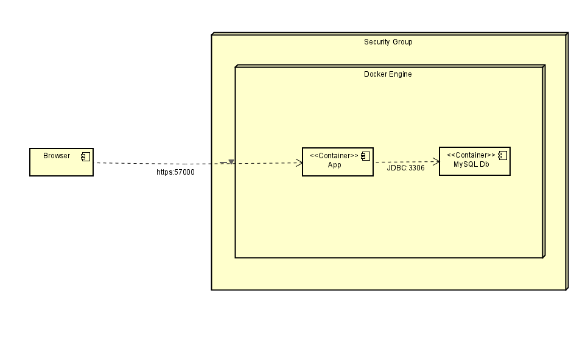
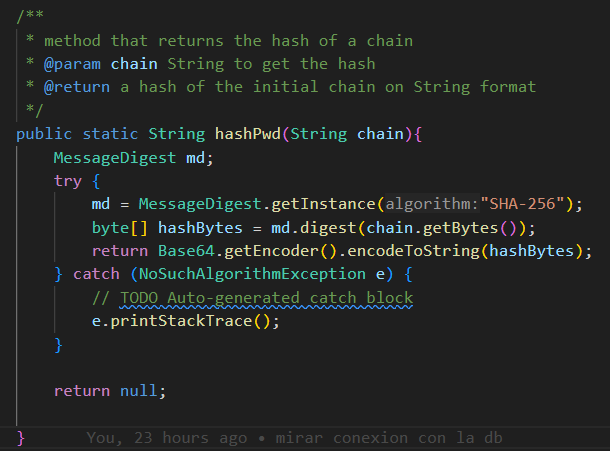
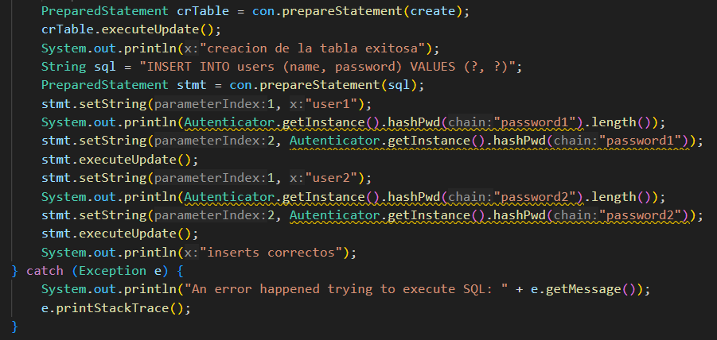
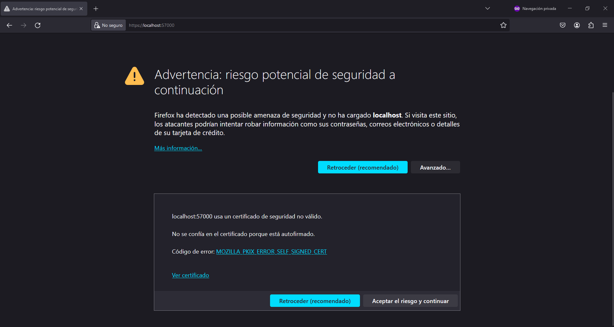
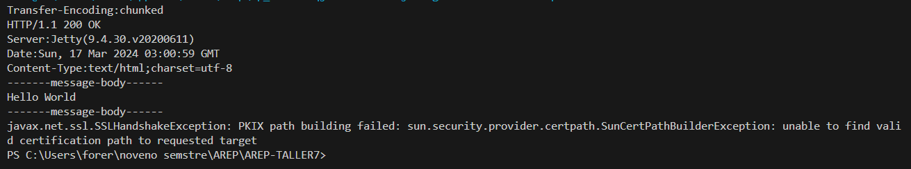
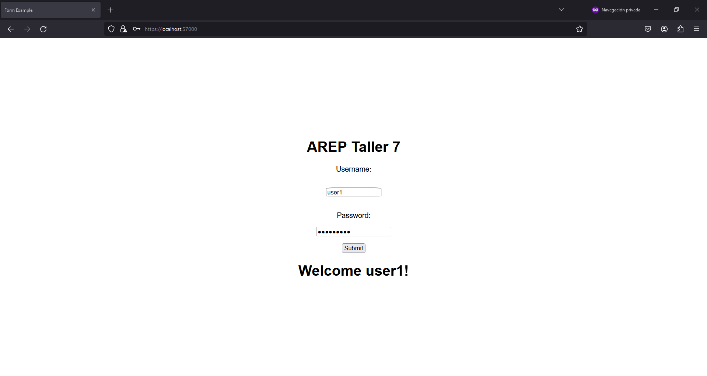
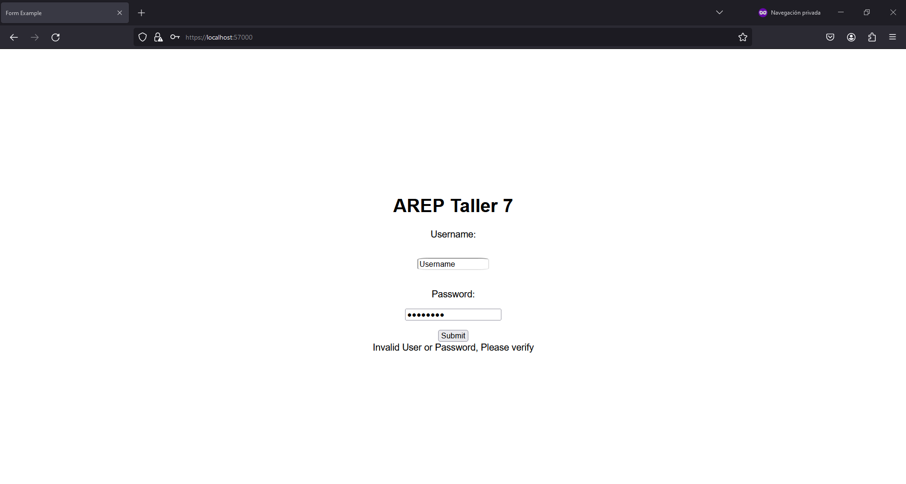

# TALLER7, ARQUITECTURA DE SEGURIDAD

Este proyecto plantea una arquitectura para un acceso seguro. Además, ilustrara generalmente un proceso de autenticación usando un nombre de usuario y contraseña para tener acceso al aplicativo de manera general.
## REQUISITOS
* [Docker desktop](https://www.docker.com/products/docker-desktop/) - Motor de contenedores
* [Java version 17](https://www.oracle.com/co/java/technologies/downloads/) - Lenguaje de programación usado.
* [Maven](https://maven.apache.org/download.cgi) - Gestor de dependencias del proyecto
* [Git](https://git-scm.com/downloads) - Gestion de versiones del proyecto 
## DESCRIPCION GENERAL DEL PROYECTO
El proyecto se puede representar en la siguiente arquitectura:



donde desde un cliente robusto, accede a la aplicación por medio del protocolo HTTP-SSL de forma segura. Luego para pedir autenticación, la aplicacón consulta a la base de datos que tambien se encuentra dentro de un contenedor Docker. Generalmente, el aplicativo solo permite autenticar usuarios y retornar si este se encuentra dentro de la Base de Datos, le da un mensaje de Bienvenida al usuario si este si esta dentro de la base de datos, o retorna un mensaje de error en caso de que no se haya podido autenticar.

Por ahora, el proyecto solo esta diseñado para validar y autenticar usuarios. Por ultimo, se almacenan los nombres de los usuarios y sus contraseñas dentro de la base de datos, con la diferencia que se almacenan contraseñas cifradas usando la siguiente implementación:



- Adjunto a este repositorio se encuentra el diagrama de la arquitectura planteada.
## EJECUCION

primero, debe clonar este repositorio en su maquina para ejecutar los comandos de ejecución

```bash
git clone https://github.com/santiforero1018/AREP-TALLER7.git
```

Para construir y lanzar la aplicación es necesario tener Docker instalado en su maquina, como se especificó en los requisitos de este proyecto. Al tener el repositorio en su maquina, entre a este desde una terminal y ejecute el siguiente comando:

```bash
mvn  clean install
mvn compile
```

Al tener ya compilado el codigo, ejecutamos el siguiente comando para levantar la aplicación:

```bash
docker-compose up -d
```
con este comando, se construye la aplicación que se implementa y ejecuta dentro de contenedores Docker. al ser levantada, ya puede acceder al servicio, pero ahora podra acceder de forma segura usando el protocolo https.

Para realizar pruebas de una autenticación correcta, se queman dos usuarios dentro de la ejecución del codigo:


Ahora, entrando a [](https://localhost:57000/) nos redirecciona a nuestra pagina web para simular el inicio de sesion y realizar las pruebas correspondientes. 

- NOTA: como no es un cifrado ni un certificado que los navegadores conocen, normalmente al tratar de entrar, saldra un aviso en su navegador como el que se muestra a continuación (Aviso mostrado en un navegador de FireFox):



    aqui lo que se debe hacer es darle a la opcion de "continuar de todas formas" para poder acceder al Login

### Pruebas 

- **Prueba con el SecureUrlReader**: Al tener compilado el codigo y con la apliación en ejecución, puede usar el IDE de su preferencia y ejecutar esta clase para probar que si se lee de manera segura la aplicación que creamos.



- **Pruebas de autenticación**: Al ingresar a la URL dada anteriormente, hacemos pruebas de lo que debe retornar al darse casos de usuarios autenticados y no autenticados

    * Usuario Autenticado: 
    

    * Usuario  No Autenticado:
    

### Demostración en AWS

A continuación se presenta un video del despliegue del proyecto en una maquina de AWS:


## OBSERVACIONES PARA EL FUTURO
Actualmente el proyecto solo cuenta con validaciones en la parte del back de la aplicación, lo que se requiere para el futuro de este proyecto es no enviar de manera explicita la contraseña al realizar una solicitud, seguir potenciando la seguridad de la aplicación he implementar nuevas funcionalidades. Por ahora, esto fue un acercamiento al manejo de autenticación de usuarios almacenando contraseñas cifradas en una base de datos.
## AUTOR
* **Santiago Forero Yate** - [santiforero1018](https://github.com/santiforero1018)

## AGRADECIMIENTOS
* Especial Agradecimiento al profesor [Luis Daniel Benavides Navarro](https://ldbn.is.escuelaing.edu.co/) por brindar el conocimiento necesario en la realización de este trabajo